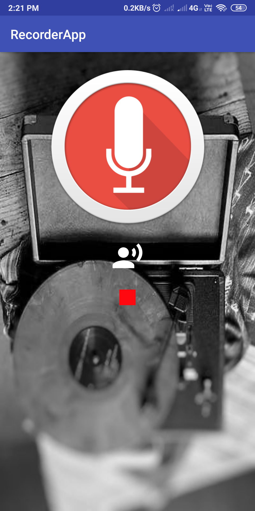

# RecorderApp

## About App
#### It is a simple audio recorder app which records the audio and create a folder with name <mark>Recorder</mark>   and the recorded audio will be saved in this folder and simultaneously update the folder accordingly.

## Screenshots

## Tech Stack

#### Language-Java,XML
#### Uses the permission to access the audio recorder for the device.
#### uses the .3gp extension for audio.
#### Added permisssion for the external storage access.
#### Auto-update the list of recordings to the destination folder.